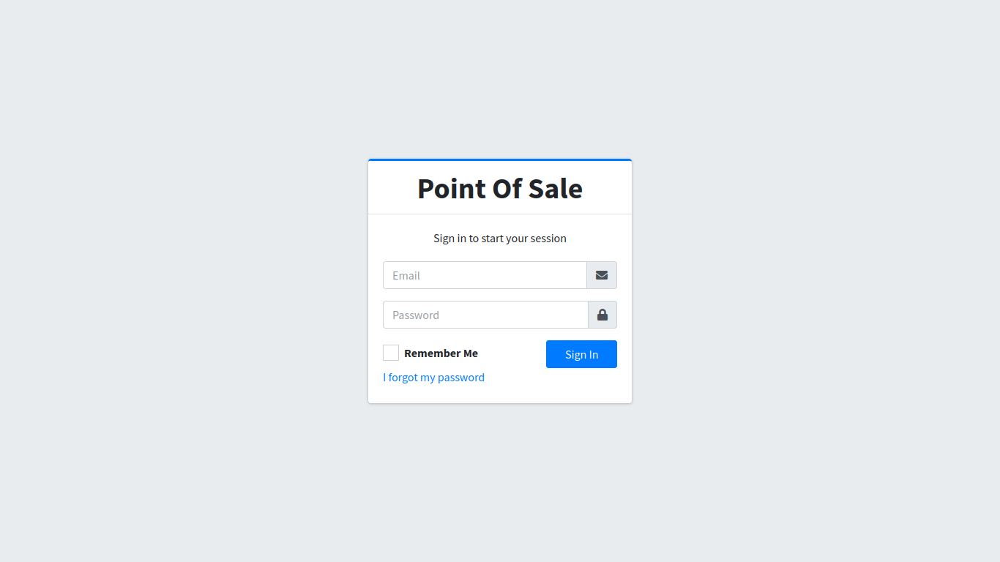
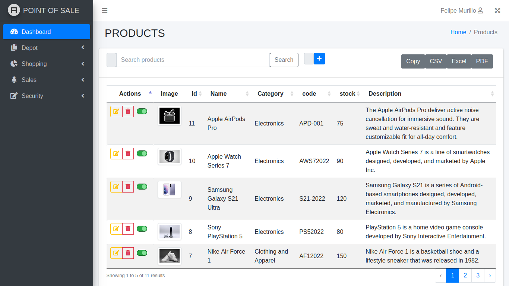
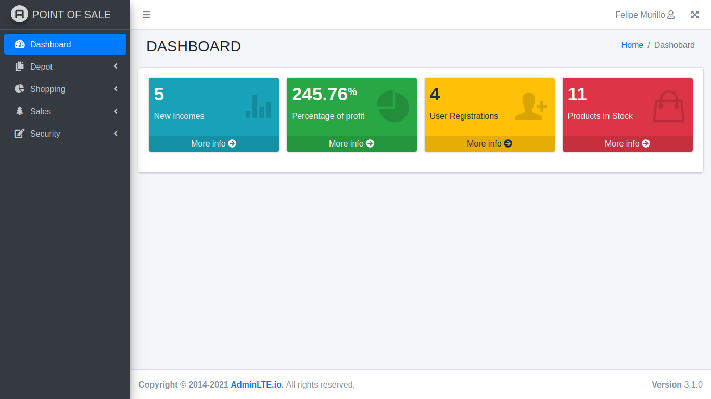

<!-- Improved compatibility of back to top link: See: https://github.com/othneildrew/Best-README-Template/pull/73 -->

<!--
*** Thanks for checking out the Best-README-Template. If you have a suggestion
*** that would make this better, please fork the repo and create a pull request
*** or simply open an issue with the tag "enhancement".
*** Don't forget to give the project a star!
*** Thanks again! Now go create something AMAZING! :D
-->

<!-- PROJECT SHIELDS -->
<!--
*** I'm using markdown "reference style" links for readability.
*** Reference links are enclosed in brackets [ ] instead of parentheses ( ).
*** See the bottom of this document for the declaration of the reference variables
*** for contributors-url, forks-url, etc. This is an optional, concise syntax you may use.
*** https://www.markdownguide.org/basic-syntax/#reference-style-links
-->
[![LinkedIn][linkedin-shield]][linkedin-url]

<!-- PROJECT LOGO -->
 

  

  <h3 align="center">Poin Of Sale (POS) Proyect</h3>

  

    Our Point of Sale (POS) system is a comprehensive solution designed to streamline sales operations for businesses of all sizes. Developed using Laravel framework and leveraging PHP, MySQL, and JavaScript technologies, this POS system offers robust features including CRUD functionalities, session management, role-based access control, and error handling. Additionally, it facilitates the generation of PDF, Excel, and CSV files for efficient reporting and analysis. With a user-friendly interface and seamless integration with various payment gateways, our POS system optimizes the sales process and enhances overall business efficiency.
     
    <a href="https://github.com/afmurillo97/POS"><strong>Explore the docs »</strong></a>
     
     
    <a href="https://www.pos-demo.online" target="_blank">View Project</a>
    ·
  

<!-- GETTING STARTED -->
## Getting Started

To enter the sales system you can do it with the following users.

### Setting Up User Accounts

To access the system locally, you will need to create user accounts with the following credentials depending on the roles you want to view:

* **Manager Account:**
  - **Email:** manager@pointofsale.com
  - **Password:** 123456

* **Guest Account:**
  - **Email:** guest@pointofsale.com
  - **Password:** 123456

<!-- SCREENSHOTS -->
## Screenshots

  
  
Start Project

  
  
  
Products Section

  
  
  
Graphics Section

(<a href="#readme-top">back to top</a>)

### Built With

This section should list any major frameworks/libraries used to bootstrap my project.

* [![PHP][PHP.dev]][PHP-url]
* [![Laravel][Laravel.com]][Laravel-url]
* [![Javascript][Javascript.dev]][Javascript-url]
* [![MySQL][MySQL.com]][MySQL-url]
* [![Composer][Composer.dev]][Composer-url]
* [![Bootstrap][Bootstrap.com]][Bootstrap-url]
* [![JQuery][JQuery.com]][JQuery-url]

(<a href="#readme-top">back to top</a>)

<!-- LICENSE -->
<!-- LICENSE -->
## License

Distributed under the MIT License. See `LICENSE.txt` for more information.

(<a href="#readme-top">back to top</a>)

<!-- CONTACT -->
## Contact

Felipe Murillo - [@murilloaf](https://twitter.com/murilloaf) - afmurillo97@gmail.com

Project Link: [https://github.com/afmurillo97/POS](https://github.com/afmurillo97/POS)

(<a href="#readme-top">back to top</a>)

<!-- ACKNOWLEDGMENTS -->
## Acknowledgments

I'd like to express my gratitude to the following libraries and tools that have been instrumental in the development of ElectroniTech:

* [Composer](https://getcomposer.org) - Dependency manager for PHP.
* [PHP](https://www.php.net) - Server-side scripting language used in the backend development.
* [Bootstrap](https://getbootstrap.com) - Frontend framework for building responsive and mobile-first websites.
* [jQuery](https://jquery.com) - JavaScript library for simplifying HTML DOM traversal and manipulation.
* [MySQL](https://www.mysql.com) - Relational database management system used for storing data.

These resources have significantly contributed to the success and functionality of the Point Of Sale project.

(<a href="#readme-top">back to top</a>)

<!-- MARKDOWN LINKS & IMAGES -->
<!-- https://www.markdownguide.org/basic-syntax/#reference-style-links -->
[contributors-shield]: https://img.shields.io/github/contributors/othneildrew/Best-README-Template.svg?style=for-the-badge
[contributors-url]: https://github.com/othneildrew/Best-README-Template/graphs/contributors
[forks-shield]: https://img.shields.io/github/forks/othneildrew/Best-README-Template.svg?style=for-the-badge
[forks-url]: https://github.com/othneildrew/Best-README-Template/network/members
[stars-shield]: https://img.shields.io/github/stars/othneildrew/Best-README-Template.svg?style=for-the-badge
[stars-url]: https://github.com/othneildrew/Best-README-Template/stargazers
[issues-shield]: https://img.shields.io/github/issues/othneildrew/Best-README-Template.svg?style=for-the-badge
[issues-url]: https://github.com/othneildrew/Best-README-Template/issues
[license-shield]: https://img.shields.io/github/license/othneildrew/Best-README-Template.svg?style=for-the-badge
[license-url]: https://github.com/othneildrew/Best-README-Template/blob/master/LICENSE.txt
[linkedin-shield]: https://img.shields.io/badge/-LinkedIn-black.svg?style=for-the-badge&logo=linkedin&colorB=555
[linkedin-url]: https://www.linkedin.com/in/felipe-murillov/
[product-screenshot]: images/screenshot.png
[Next.js]: https://img.shields.io/badge/next.js-000000?style=for-the-badge&logo=nextdotjs&logoColor=white
[Next-url]: https://nextjs.org/
[React.js]: https://img.shields.io/badge/React-20232A?style=for-the-badge&logo=react&logoColor=61DAFB
[React-url]: https://reactjs.org/
[Vue.js]: https://img.shields.io/badge/Vue.js-35495E?style=for-the-badge&logo=vuedotjs&logoColor=4FC08D
[Vue-url]: https://vuejs.org/
[Angular.io]: https://img.shields.io/badge/Angular-DD0031?style=for-the-badge&logo=angular&logoColor=white
[Angular-url]: https://angular.io/
[Svelte.dev]: https://img.shields.io/badge/Svelte-4A4A55?style=for-the-badge&logo=svelte&logoColor=FF3E00
[Svelte-url]: https://svelte.dev/
[PHP.dev]: https://img.shields.io/badge/php-url?style=for-the-badge&logo=php&logoColor=%23FFFFFF&labelColor=%23777BB4&color=%23777BB4
[PHP-url]: https://php.net/
[Composer.dev]: https://img.shields.io/badge/composer-url?style=for-the-badge&logo=composer&logoColor=%23FFFFFF&labelColor=%23885630&color=%23885630
[Composer-url]: https://getcomposer.org
[Javascript.dev]: https://img.shields.io/badge/javascript-url?style=for-the-badge&logo=javascript&logoColor=%23FFFFFF&labelColor=%23F7DF1E&color=%23F7DF1E
[Javascript-url]: https://javascript.com
[Laravel.com]: https://img.shields.io/badge/Laravel-FF2D20?style=for-the-badge&logo=laravel&logoColor=white
[Laravel-url]: https://laravel.com
[Bootstrap.com]: https://img.shields.io/badge/Bootstrap-563D7C?style=for-the-badge&logo=bootstrap&logoColor=white
[Bootstrap-url]: https://getbootstrap.com
[JQuery.com]: https://img.shields.io/badge/jQuery-0769AD?style=for-the-badge&logo=jquery&logoColor=white
[JQuery-url]: https://jquery.com
[MySQL.com]: https://img.shields.io/badge/mysql-url?style=for-the-badge&logo=mysql&logoColor=%23FFFFFF&labelColor=%234479A1&color=%234479A1
[MySQL-url]: https://mysql.com 
